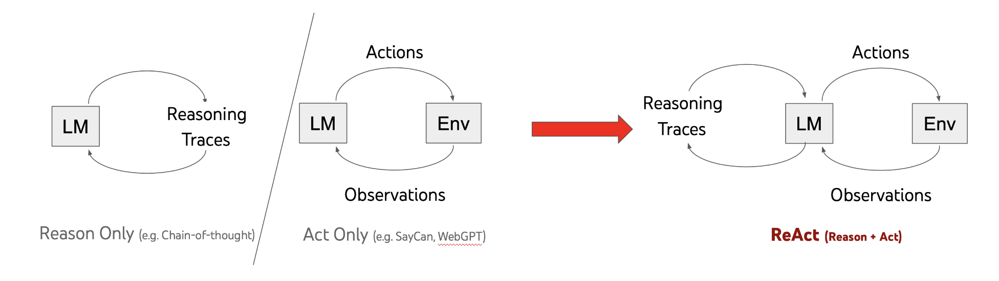

# 🍦🤖 Vanilla ReAct

## 🌟 Overview

This project implements a [ReAct](https://react-lm.github.io/) (Reasoning and Acting) agent using the [OpenAI API](https://openai.com/api/), and without the use of any conversational AI frameworks. The agent can engage in a conversation loop, perform actions based on its reasoning, and incorporate observations from these actions into its decision-making process.


*[Image credit](https://react-lm.github.io/)*

## Contents

- [🚀 Features](#-features)
- [📋 Requirements](#-requirements)
- [🛠 Installation](#-installation)
- [🏃‍♂️ Usage](#️-usage)
- [🧩 Configuration](#-configuration)
- [🧰 Components](#-components)
- [🔌 Extending Functionality](#-extending-functionality)
- [⚠️ Limitations](#️-limitations)
- [📄 License](#-license)
- [🙏 Acknowledgements](#-acknowledgements)

## 🚀 Features

- Dynamic action execution based on agent responses
- Integration with OpenAI API for natural language processing
- Extensible action registry for adding new capabilities
- Built-in Wikipedia search and calculation functions
- Configurable conversation loop with a maximum turn limit

## 📋 Requirements

- 🐍 Python 3.7+
- 🔑 [OpenAI API key](https://platform.openai.com/api-keys)
- [`httpx`](https://pypi.org/project/httpx/) library for HTTP requests
- [`openai`](https://pypi.org/project/openai/) library for API interactions

## 🛠 Installation

1. Clone this repository
2. Install required packages:

    ```bash
    pip install -r requirements.txt
    ```

3. Set your OpenAI API key as an environment variable:

    ```bash
    export OPENAI_API_KEY="your-api-key"
    ```

## 🏃‍♂️ Usage

Run the agent script with a custom query:

```bash
python main.py "Your question here"
```

For example:

```bash
python main.py "What is the square root of the number of countries that border France?"
```

Would yield the following output:

```txt
Thought: To find the square root of the number of countries that border France, I first need to determine how many countries share a border with France. I should look this up on Wikipedia.

Action: wikipedia: France

PAUSE
 -- running wikipedia France
Observation: <span class="searchmatch">France</span>, officially the <span class="searchmatch">French</span> Republic, is a country located primarily in Western Europe. It also includes overseas regions and territories in the Americas
Thought: The initial summary did not provide information about the number of countries that border France. I need to look up the specific information about France's borders.

Action: wikipedia: Borders of France

PAUSE
 -- running wikipedia Borders of France
Observation: <span class="searchmatch">French</span> Republic has terrestrial <span class="searchmatch">borders</span> with 10 sovereign states, 8 <span class="searchmatch">bordering</span> Metropolitan <span class="searchmatch">France</span> and 2 <span class="searchmatch">bordering</span> the Overseas Departments <span class="searchmatch">of</span> <span class="searchmatch">France</span>,
Thought: France has a total of 10 countries that share its borders. I now need to calculate the square root of 10.

Action: calculate: 10 ** 0.5

PAUSE
 -- running calculate 10 ** 0.5
Observation: 3.1622776601683795
Answer: The square root of the number of countries that border France is approximately 3.16.
```

If no question is provided, the script will use a default query, defined in [`config.py`](config.py).

## 🧩 Configuration

The `config` file contains various settings that control the behavior of the agent and the query engine. Below are the key configurations:

- **OpenAI settings**:
  - `OPENAI_MODEL`: The model used for generating responses (default: `gpt-4o`).
  - `OPENAI_TEMPERATURE`: The temperature setting for the model, which controls the randomness of the output (default: 0).

- **Agent settings**:
  - `react_instructions`: Instructions for the agent on how to process and respond to questions.
  - `action_instructions`: Instructions detailing the available actions the agent can perform.
  - `react_example`: An example session demonstrating how the agent should behave.
  - `AGENT_SYSTEM_PROMPT`: A combined prompt that includes the above instructions and example, used to initialize the agent.

- **QueryEngine settings**:
  - `ACTION_REGEX`: A regular expression pattern to identify actions in the agent's responses.

- **Default question**:
  - `DEFAULT_QUESTION`: The default question to be used if no question is provided by the user.


## 🧰 Components

1. `Agent`: Manages conversation with the AI model
2. `Action`: Defines executable actions
3. `ActionRegistry`: Stores and retrieves available actions
4. `QueryEngine`: Orchestrates the conversation loop and action execution

## 🔌 Extending Functionality

To add new actions:

1. Define a new function that performs the desired action in [`tools.py`](tools.py)
2. Register the function in the [`main`](main.py) function using:

    ```python
    action_registry.register("action_name", action_function)
    ```

3. Update the `action_instructions` in [`config.py`](config.py) to include the new action.

## ⚠️ Limitations

- Wikipedia searches are limited to the first result's snippet
- Tools can only accept a single string as input
- The [`main`](main.py) function doesn't handle follow up questions or context, though this is supported by the framework.

## 📄 License

This project is open source and available under the [MIT License](LICENSE).

## 🙏 Acknowledgements

This project was inspired by Simon Willison's [A simple Python implementation of the ReAct pattern for LLMs](https://til.simonwillison.net/llms/python-react-pattern), and leverages Simon's [simple Python wrapper for the ChatGPT API](https://til.simonwillison.net/gpt3/chatgpt-api)
